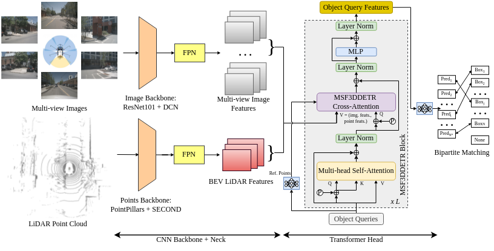

# MSF3DDETR: Multi-Sensor Fusion 3D Detection Transformer for Autonomous Driving

This is the official PyTorch implementation of the paper **[MSF3DDETR: Multi-Sensor Fusion 3D Detection Transformer for Autonomous Driving](https://arxiv.org/abs/2210.15316)**, by Gopi Krishna Erabati and Helder Araujo at *International Conference on Pattern Recognition Workshop (ICPRW 2022) Deep Learning for Visual Detection and Recognition (DLVDR2022)*.

Our implementation is based on MMDetection3D.

## Abstract
3D object detection is a significant task for autonomous driving. Recently with the progress of vision transformers, the 2D object detection problem is being treated with the set-to-set loss. Inspired by these approaches on 2D object detection and an approach for multi-view 3D object detection DETR3D, we propose MSF3DDETR: Multi-Sensor Fusion 3D Detection Transformer architecture to fuse image and LiDAR features to improve the detection accuracy. Our end-to-end single-stage, anchor-free and NMS-free network takes in multi-view images and LiDAR point clouds and predicts 3D bounding boxes. Firstly, we link the object queries learnt from data to the image and LiDAR features using a novel MSF3DDETR cross-attention block. Secondly, the object queries interacts with each other in multi-head self-attention block. Finally, MSF3DDETR block is repeated for L number of times to refine the object queries. The MSF3DDETR network is trained end-to-end on the nuScenes dataset using Hungarian algorithm based bipartite matching and set-to-set loss inspired by DETR. We present both quantitative and qualitative results which are competitive to the state-of-the-art approaches.



## Results

### Predictions


### nuScenes Dataset

| Image Backbone | LiDAR Backbone | mAP | NDS | Weights |
| :---------: | :---------: | :----: |:----: | :------: |
| ResNet101 w/ DCN | VoxelNet | 60.6 | 66.7 | [Model](https://drive.google.com/file/d/12ohqEgSqLNbLwhGvsWlmuMFCTy9wJpDu/view?usp=sharing) |
| ResNet101 w/ DCN | PointPillars | 54.5 | 61.4 | [Model](https://drive.google.com/file/d/1o4JoLX4TuwP7jDHTsIjIf_XpC-J5JStg/view?usp=sharing) |
| ResNet50 w/ DCN | VoxelNet | 59.5 | 66.0 | [Model](https://drive.google.com/file/d/10bt6xvrG0yJ-sIkxave33BIwO-6sFz8C/view?usp=sharing) |
| ResNet50 w/ DCN | PointPillars | 53.1 | 59.6 |  |

## Usage

### Prerequisite

The code is tested on the following configuration:
- python==3.6
- cuda==11.1
- PyTorch==1.8.1
- [mmcv](https://github.com/open-mmlab/mmcv)==1.4.2
- [mmdet](https://github.com/open-mmlab/mmdetection)==2.20.0
- [mmseg](https://github.com/open-mmlab/mmsegmentation)==0.20.2
- [mmdet3d](https://github.com/open-mmlab/mmdetection3d)==0.18.0

### Data
Follow [MMDetection3D](https://mmdetection3d.readthedocs.io/en/latest/data_preparation.html) to prepare the nuScenes dataset and symlink the data directory to `data/` folder of this repository.

### Clone the repository
```
git clone https://github.com/gopi231091/MSF3DDETR.git
cd MSF3DDETR
```

### Training

1. Download the [backbone pretrained weights](https://drive.google.com/drive/folders/1AA-QuhJzLW-t-1CXCkJjXXr-75oTrNL4?usp=sharing) to `ckpts/`
2. Add the present working directory to PYTHONPATH `export PYTHONPATH=$(pwd):$PYTHONPATH`
3. To train the MSF3DDETR with ResNet101 and VoxelNet backbones on 2 GPUs, please run

`tools/dist_train.sh configs/msf3ddetr_r101_voxel_adam_nus-3d.py 2 --work-dir {WORK_DIR}`

### Testing
1. Downlaod the weights of the models accordingly.
2. Add the present working directory to PYTHONPATH `export PYTHONPATH=$(pwd):$PYTHONPATH`
3. To evaluate the model using 2 GPUs, please run

`tools/dist_test.sh configs/msf3ddetr_r101_voxel_adam_nus-3d.py /path/to/ckpt 2 --eval=bbox`

## Acknowlegement
We sincerely thank the contributors for their open-source code: [MMCV](https://github.com/open-mmlab/mmcv), [MMDetection](https://github.com/open-mmlab/mmdetection), [MMDetection3D](https://github.com/open-mmlab/mmdetection3d) and [DETR3D](https://github.com/WangYueFt/detr3d).

## Reference
Feel free to cite our article if you find our method useful.
```

```

